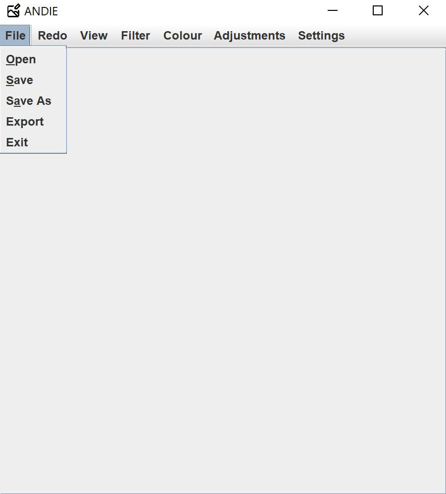
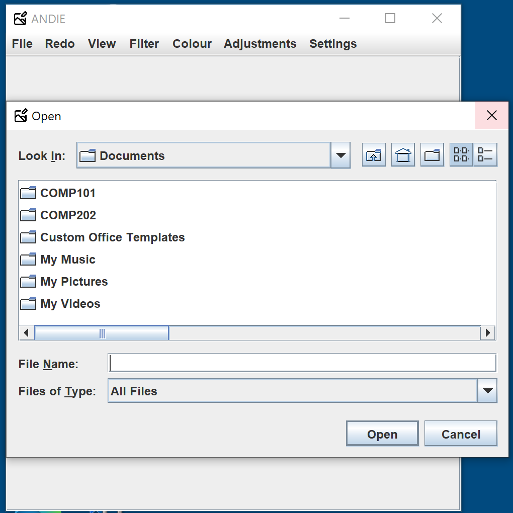
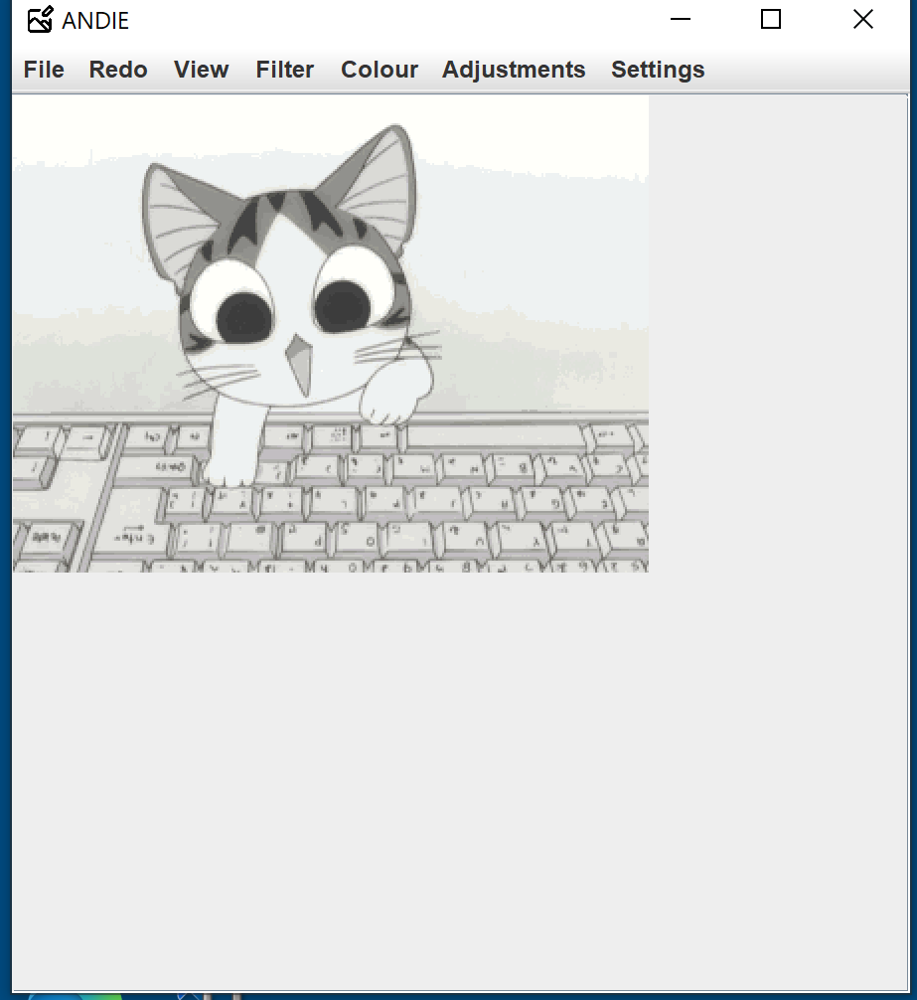
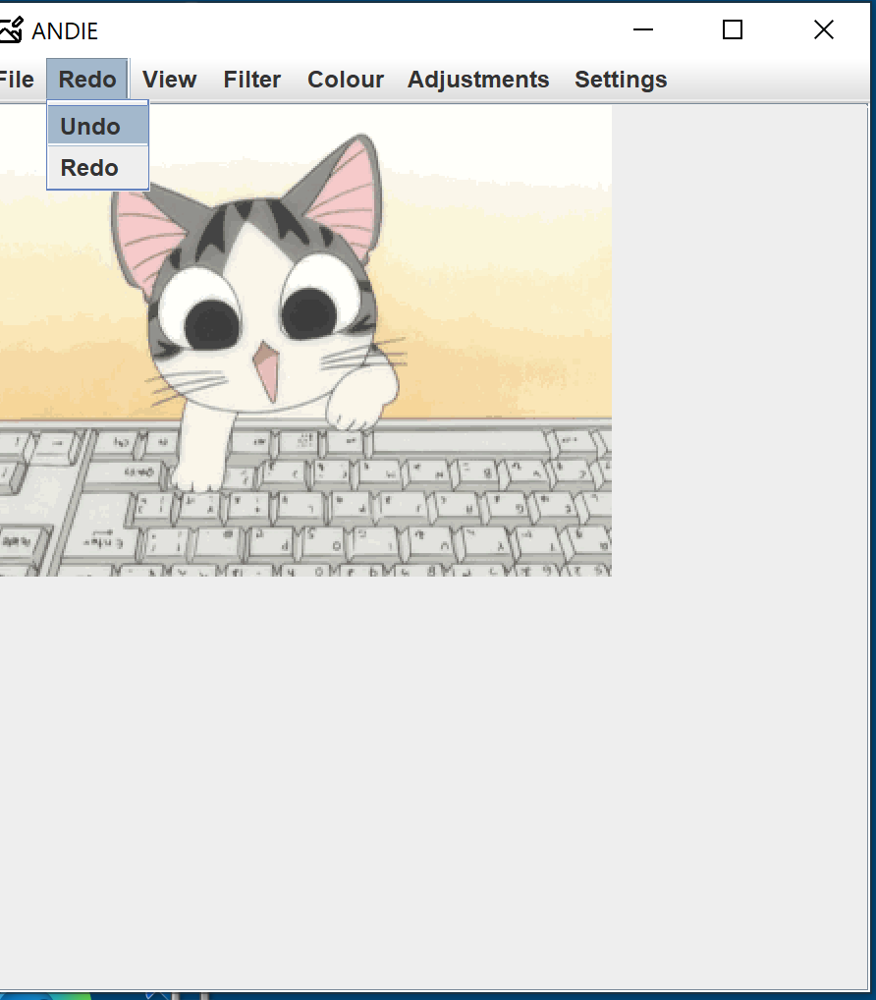
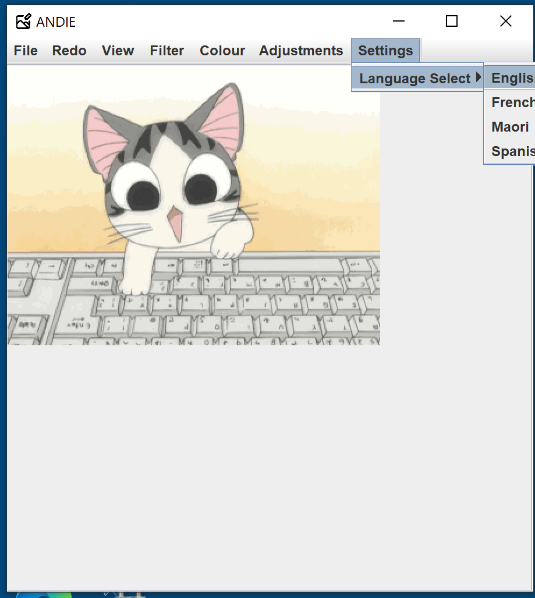

## Getting Started

Welcome to the VS Code Java world. Here is a guideline to help you get started to write Java code in Visual Studio Code.

## Folder Structure

The workspace contains two folders by default, where:

- `src`: the folder to maintain sources
- `lib`: the folder to maintain dependencies

Meanwhile, the compiled output files will be generated in the `bin` folder by default.

> If you want to customize the folder structure, open `.vscode/settings.json` and update the related settings there.

## Dependency Management

The `JAVA PROJECTS` view allows you to manage your dependencies. More details can be found [here](https://github.com/microsoft/vscode-java-dependency#manage-dependencies).

# ANDIE - A Non Destructive Image Editor

ANDIE is a program that allows a user to alter a given image. Examples are changing the brightness or increasing the size. These are offered as options in a menu bar at the top of the window. The program itself appears as a window, with a frame in the middle of the window that displays the image. It is non-destructive as it can preserve the original image. 

---
## Requirements

ANDIE requires a JDK of version 17 or later to function as intended. 
Other than this, there are no special requirements.

---
## Table of Contents (Optional)

If your README is long, add a table of contents to make it easy for users to find what they need.

- [Installation](#installation)
- [Usage](#usage)
- [Credits](#credits)
- [License](#license)
- [Features](#features)
- [Milestones](#milestones)
- [Versions](#versions)

---
## Installation

- Install OpenJDK (preferably Version 17 or later) from [https://jdk.java.net/archive/]

- Boom, ANDIE should run!

---
## Usage

- Begin by running the ANDIE executable

- Navigate to the File option in the menu at the top of the window

- Click on it, and select Open

- Find a suitable image file to use in ANDIE and select it

- Try various options and their affects on the image!

- If you want to revert a change made, navigate to the Redo option and click it

- Select the Undo option to revert a change

- If you would like the text to be in a different language, click settings and select a given language. (Version 1.1 has 4 available, English, Maori, French, Spanish)

- And finally to save your changed image, select File, then one of the options save, save as, or export. Save overwrites the original with the altered version, save as saves a new copy to a location
of your choosing, and export allows you to explicity specify file type on save.

---
## Credits

This was collaborative effort of Carinn, Anthony, Lachlan and Liam. 
GitLab accounts are gasca681, donan928, grala465 and kerli421.

The base project was supplied by the Computer Science Department of Otago University
In particular David Eyers of said department provided a lot of the base code. 

---
## License

Copyright (c) [2003] [Liam Aran Kerr]

Permission is hereby granted, free of charge, to any person obtaining a copy
of this software and associated documentation files (the "Software"), to deal
in the Software without restriction, including without limitation the rights
to use, copy, modify, merge, publish, distribute, sublicense, and/or sell
copies of the Software, and to permit persons to whom the Software is
furnished to do so, subject to the following conditions:

The above copyright notice and this permission notice shall be included in all
copies or substantial portions of the Software.

THE SOFTWARE IS PROVIDED "AS IS", WITHOUT WARRANTY OF ANY KIND, EXPRESS OR
IMPLIED, INCLUDING BUT NOT LIMITED TO THE WARRANTIES OF MERCHANTABILITY,
FITNESS FOR A PARTICULAR PURPOSE AND NONINFRINGEMENT. IN NO EVENT SHALL THE
AUTHORS OR COPYRIGHT HOLDERS BE LIABLE FOR ANY CLAIM, DAMAGES OR OTHER
LIABILITY, WHETHER IN AN ACTION OF CONTRACT, TORT OR OTHERWISE, ARISING FROM,
OUT OF OR IN CONNECTION WITH THE SOFTWARE OR THE USE OR OTHER DEALINGS IN THE
SOFTWARE.

---

## Features

- Open, Save, Export images of type PNG, JPG and GIF

- Undo and Redo changes made to an image in the editor

- Zoom in and out, and reset the zoom scale

- Apply a soft blur, sharpen, Gaussian and Mean filters to the image

- Make the image greyscale and alter its brightness and contrast

- Increase an images size, rotate the image by 90 degrees, and flip the image

- And change the language of the editor to either English (default), Maori, French or Spanish.
 
--- 

## Milestones

### Milestone 1

**Who did what**
Carinn completed Sharpen, Soft Blur, Gaussian Blur, and mean filter.

Anthony completed Change Size, Rotate Image and Image Flip. 

Lachlan completed Multilingual Support and Error Handling. 

Liam completed Brightness and Contrast, writing the README documentation and some JUnit testing.

**Code Testing** 

Code was mainly tested through brute force methods rather than JUnit testing, a fact that we will change for the next submission. After implementing some JUnit testing very late into our developement of ANDIE for the first milestone, we discovered how useful having unit tests to check previous bits of code could be. We will be implementing them for the next part of ANDIE. Lachlan in particular did the bulk of the brute force testing, as he was developing the error handling. 

As for brute force testing, a lot of it was done with print statements, and passing in images to ANDIE to check if our methods were working correctly, rather than using JUnit testing. This was done on an individual basis, as each team member worked on their part of the project, they would test and ensure their piece of software was working correctly. Lachlan went through and tried to break ANDIE repeatedly, and we found several more errors from that.

In future, testing will be a much larger part of our operative workflow.

---

## Versions

1.0 : Base form of ANDIE supplied by Department of Computer Science.

1.1 : Added Sharpen, Gaussian blur, mean filter, soft blur, brightness and contrast altering, increase size, rotate by 90 degrees, flip, and multilingual support